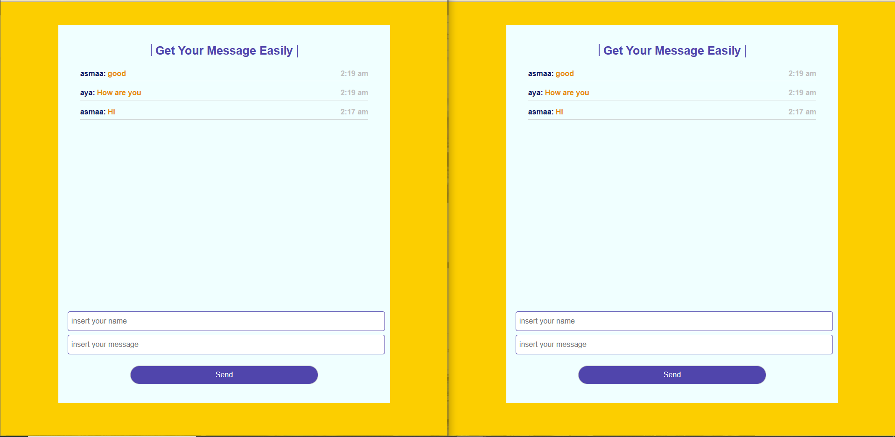

# Welcome! 👋

## To run the chat

after start Apache and mySql

1- donload the file
2- create database and name it chat
3- create a table and named it chatroom
4- create four column (id,name,msg,date)
5- open the index.php file in two tabs to see the output

### Built with

- Semantic HTML5 markup
- Scss
- Js
- PHP
- MySql

### What I learned

- make database and work with it
- insert & select data
- use ajax request

### Note

- Please, if you see any mistakes i made in writing the code, or you have any advice for me to improve, please tell me. :)

## Author

- Website - [Asmaa-elfatayry](https://github.com/asmaa-elfatayry)
- Frontend Mentor - [@asmaa-elfatayry](https://www.frontendmentor.io/profile/asmaa-elfatayry)
- Linkedin - [Asmaa Elfatayry](https://www.linkedin.com/in/asmaa-elfatayry/)
